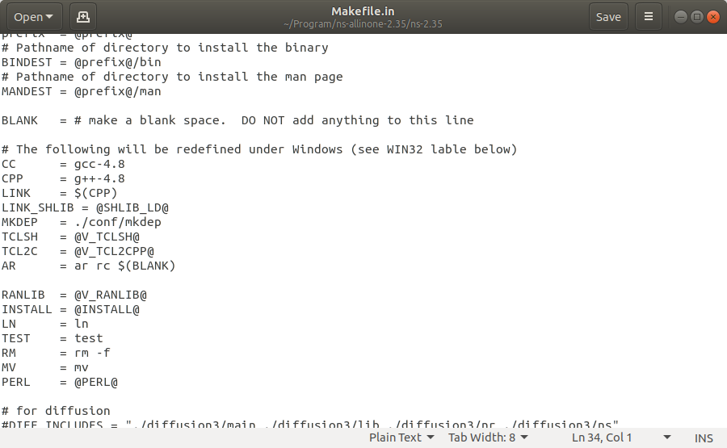
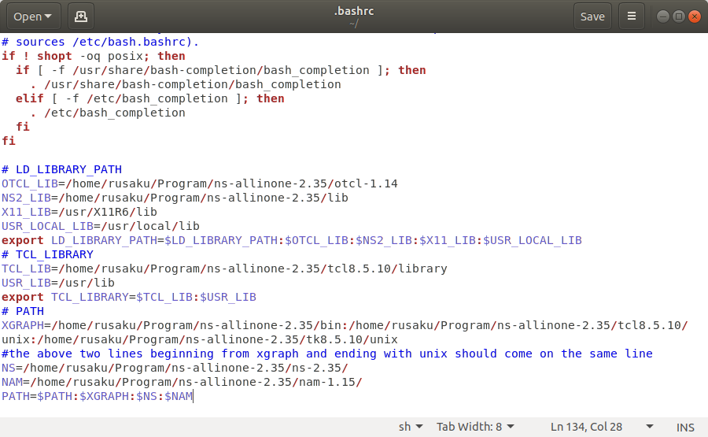

# Instalasi NS2 di Linux

Tested: Ubuntu 18.04

## 1. Download dan Ekstrak file arsip Installer NS2
Download dulu file ns2 di [sini](http://sourceforge.net/projects/nsnam/files/latest/download)

File bisa diekstrak di folder sembarang. Tetapi di sini agar rapi buat folder `Program` dulu di direktori `Home`:
	
	mkdir ~/Program
	cp ~/Downloads/ns-allinone-2.35.tar.gz ~/Program/	
	tar -xvzf ~/Program/ns-allinone-2.35.tar.gz

## 2. Install dependencies, gcc, dan software pendukung
Install dependencies:
	
	sudo apt-get install build-essential autoconf automake libxmu-dev gcc-4.8 g++-4.8 gedit -y

## 3. Ubah sesuatu di dalam folder ns
buka file `ls.h` di dalam folder ns tepatnya di linkstate

	gedit ~/Program/ns-allinone-2.35/ns-2.35/linkstate/ls.h
lalu pada baris ke 137, ubah `erase` menjadi `this->erase` seperti pada gambar

buka file `Makefile.in` di dalam folder `ns-2.35`

	gedit ~/Program/ns-allinone-2.35/ns-2.35/Makefile.in
lalu ubah `@CC@` dan `@CXX@` menjadi `gcc-4.8` seperti pada gambar

## 4. Mulai instalasi
Pindah ke folder ns

	cd ~/Program/ns-allinone-2.35/
lalu install

	sudo ./install

## 5. Setting environment
masukkan perintah:

	sudo gedit ~/.bashrc
lalu masukkan baris berikut ini (rekomendasi: di akhir baris seperti pada gambar):

	# LD_LIBRARY_PATH
	OTCL_LIB=/home/rusaku/Program/ns-allinone-2.35/otcl-1.14
	NS2_LIB=/home/rusaku/Program/ns-allinone-2.35/lib
	X11_LIB=/usr/X11R6/lib
	USR_LOCAL_LIB=/usr/local/lib
	export LD_LIBRARY_PATH=$LD_LIBRARY_PATH:$OTCL_LIB:$NS2_LIB:$X11_LIB:$USR_LOCAL_LIB
	# TCL_LIBRARY
	TCL_LIB=/home/rusaku/Program/ns-allinone-2.35/tcl8.5.10/library
	USR_LIB=/usr/lib
	export TCL_LIBRARY=$TCL_LIB:$USR_LIB
	# PATH
	XGRAPH=/home/rusaku/Program/ns-allinone-2.35/bin:/home/rusaku/Program/ns-allinone-2.35/tcl8.5.10/unix:/home/rusaku/Program/ns-allinone-2.35/tk8.5.10/unix
	#the above two lines beginning from xgraph and ending with unix should come on the same line
	NS=/home/rusaku/Program/ns-allinone-2.35/ns-2.35/ 
	NAM=/home/rusaku/Program/ns-allinone-2.35/nam-1.15/ 
	PATH=$PATH:$XGRAPH:$NS:$NAM

lalu ganti nama user `rusaku` menjadi nama usermu. Contoh, misal nama usermu `bejo`.

ubah `OTCL_LIB=/home/Program/rusaku/ns-allinone-2.35/otcl-1.14` menjadi `OTCL_LIB=/home/Program/bejo/ns-allinone-2.35/otcl-1.14`

dan seterusnya

cara cepatnya:

	1. ctrl + H
	2. find: rusaku
	3. replace with: bejo
	4. replace all

## 6. Tes apakah ns2 sudah terinstall dengan benar

**Restart linux dulu** (kalau butuh)

Lalu coba masukkan perintah ns di terminal.

Pastikan muncul seperti pada gambar

Selesai :)

## Sumber
https://www.howtoforge.com/tutorial/ns2-network-simulator-on-ubuntu-14.04/

https://www.youtube.com/watch?v=FXm8i1K-6jI